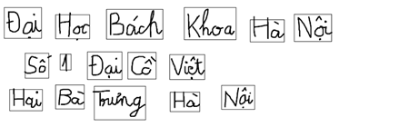
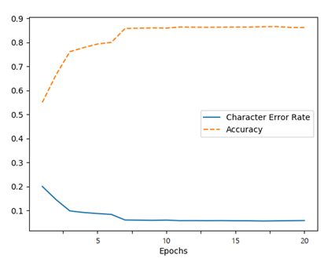
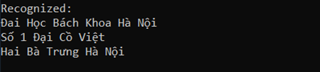

## Preprocess image
I used a word-segmentation algorithm like the one proposed by [R. Manmatha and N. Srimal](http://ciir.cs.umass.edu/pubfiles/mm-27.pdf). The algorithm takes an image as input and outputs the segmented words.

## Information about model
The model consists of 5 CNN layers, 2 RNN (Bi-LSTM) layers and the CTC loss and decoding layer and can handle a full page of text image
* The input image is a gray-value image and has a size of 128x32.
* 5 CNN layers map the input image to a feature sequence of size 32x256.
* 2 LSTM layers with 256 units propagate information through the sequence and map the sequence to a matrix of size 32x148. Each matrix-element represents a score for one of the 148 characters at one of the 32 time-steps.
* The CTC layer either calculates the loss value given the matrix and the ground truth text (when training), or it decodes the matrix to the final text with beam search decoding.
* Batch size is set to 64.

Highest accuracy achieved is 0.87 and character error rate is 0.056 in testset (the dataset is split into 95% of the samples used for training and 5% for testing as defined in the class DataLoader) and positive recognition result:

 

## Improve accuracy
Here are some ideas how to improve it:
* Increase input size.
* Add more CNN layers or use transfer learning on CNN.
* Replace Bi-LSTM by 2D-LSTM.
* Decoder: use word beam search decoding (see [CTCWordBeamSearch](https://repositum.tuwien.ac.at/obvutwoa/content/titleinfo/2774578)).

## References
[1] [An End-to-End Trainable Neural Network for Image-based Sequence Recognition and Its Application to Scene Text Recognition](https://arxiv.org/pdf/1507.05717.pdf)

[2] [ICFHR2018 Competition on Vietnamese Online Handwritten Text Recognition Database (HANDS-VNOnDB2018)](http://tc11.cvc.uab.es/datasets/HANDS-VNOnDB2018_1)
